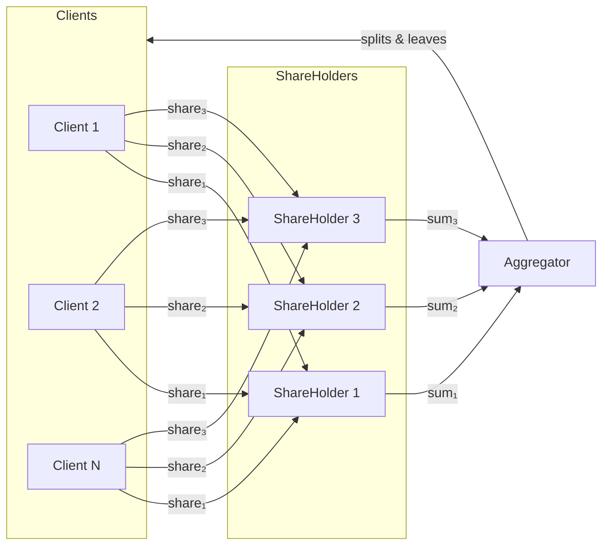

# privateboost Design

**privateboost** implements privacy-preserving federated XGBoost using additive secret sharing. Multiple data owners (clients) train a gradient boosting model without revealing their individual data—each client splits their values into random shares distributed across multiple shareholders, who forward only aggregated sums to a central aggregator. The aggregator learns statistical properties needed for training but never sees individual contributions.

## Architecture



Each client's value `v` is split into random shares where `share₁ + share₂ + share₃ = v`. Shareholders sum shares across all clients, then the aggregator reconstructs the total: `sum₁ + sum₂ + sum₃ = Σv`.

## How It Works

**Secret Sharing**: To share a value `v` among `n` shareholders, the client generates `n-1` random numbers and sets the last share to make them sum to `v`:

```
shares = [random₁, random₂, ..., v - Σrandomᵢ]
```

Each shareholder receives one share—individually meaningless random noise.

**Aggregation**: Each shareholder sums the shares it receives from all clients, then forwards this sum to the aggregator. The aggregator adds the sums from all shareholders, recovering the true total without ever seeing individual values.

**XGBoost Training**: The protocol runs multiple rounds:
1. **Statistics round** — clients share `x` and `x²` to compute global mean/variance for histogram binning
2. **Gradient rounds** — for each tree level, clients share gradient histograms; the aggregator finds optimal splits and broadcasts decisions back to clients

## Histogram Construction

**Bin Definition**: After the statistics round, the aggregator knows the global mean (μ) and standard deviation (σ) for each feature. It defines histogram bins spanning μ ± 3σ, divided into `n_bins` equal-width intervals, plus underflow and overflow bins for outliers:

```
edges = [-∞, μ-3σ, ..., μ+3σ, +∞]
```

This creates `n_bins + 2` total bins per feature.

**One-Hot Voting**: To privately count how many clients fall in each bin, each client encodes its bin as a one-hot vector (all zeros except a 1 at the bin index), then secret-shares this vector. When shareholders sum their shares and the aggregator reconstructs, the result is a histogram of counts—without revealing which client contributed to which bin.

```
Client value: 42.5 → bin index 3 → [0, 0, 0, 1, 0, ...] → secret-share
```

**Gradient Histograms**: For XGBoost, clients don't just vote "present"—they contribute their gradient and hessian to the appropriate bin. Each client computes:
- `gradient = prediction - target` (for squared loss)
- `hessian = 1.0` (or `p(1-p)` for logistic loss)

Then places these values in the bin corresponding to each feature value, creating per-feature gradient/hessian vectors that are secret-shared. The aggregator reconstructs summed gradients per bin, enabling it to find the optimal split threshold by evaluating cumulative gain across bin boundaries.

## Security Guarantees

**Confidentiality**: No single party learns individual client values. Shareholders see only random shares; the aggregator sees only aggregate sums across all clients.

**Collusion Resistance**: Reconstructing any individual value requires *all* shareholders to collude. With 3 shareholders, any 2 colluding still cannot recover client data—they're missing one share, which is random and unbounded.

**Threat Model**: The protocol assumes *honest-but-curious* adversaries—parties follow the protocol correctly but may try to learn extra information from messages they receive. All parties are assumed to execute the prescribed algorithms faithfully.

## Limitations

**No malicious party protection**: A shareholder or aggregator that deviates from the protocol (sending wrong values, dropping messages) can corrupt results or potentially leak information. The protocol does not detect or prevent Byzantine behavior.

**No differential privacy**: Aggregate statistics are revealed exactly. With auxiliary knowledge, an adversary might infer properties about individuals from these aggregates.

**Communication overhead**: Each client sends `n_shareholders` messages per round. Total messages scale as `O(clients × shareholders × rounds)`.

**Trusted aggregator**: The aggregator learns true aggregate statistics. While it cannot see individual values, it has more information than any other party.
